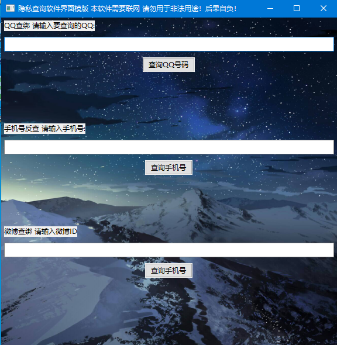
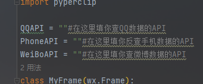

# 隐私查询类软件的UI代码模版（python）
# 公告
代码仓库重新更新啦，发布release供学习参考
# 👽宇宙安全声明：
* 软件并不提供查询API，并不具备实际性查询能力，请勿用于违法犯罪
* 代码仅供交流学习，后果自负，作者概不负责，你应该在下载源代码的24小时内删除所有相关文件，下载，修改或使用此仓库的任意资源即为同意此协议
* 软件背景图片来源于网络
* 代码写的不是很好，凑合着看吧😊
# ⚡️快速上手：
* 1.克隆或下载此存储库，推荐使用以下命令：
   ```
   git clone https://github.com/OpenBMB/ChatDev.git
   ```
* 2.设置 Python 环境：确保您具有版本 3.9 或更高版本的 Python 环境。
* 3.在PyCharm打开刚刚下载的存储库
* 4.安装依赖项，在终端依次输入：
  ```
  pip install wxpython
  pip install requests
  pip install pyperclip
  ```
### 😃用wxpython写的GUI，requests是著名的网络库不必多说，pyperclip用来复制内容到剪贴板
* 运行kaihu.py文件即可，如果出现GUI则代表运行成功

# 软件并不提供查询API！请自行在代码中填入API方可使用，Release中的exe仅供参考  

